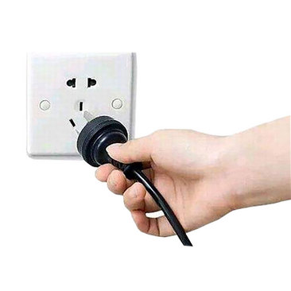
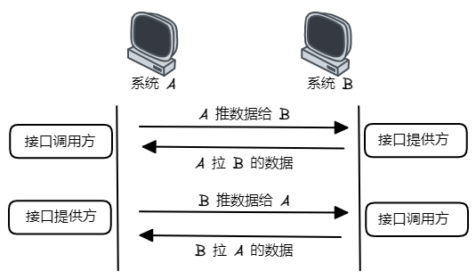

## 什么是接口

### 通用的接口定义

- 在两个不同的系统或者一个系统中两个不同功能，他们之间相互连接的部分称为接口。例如：

  - 电插座和插头

  - 水龙头和洗衣机的进水管上的接头

### 计算机领域中的接口定义

- 接口通常用于描述两个计算机系统之间的交互方式。接口就是两个系统之间的交流桥梁，确保它们可以协同工作。

### OOP编程中的接口定义

- OOP面向对象的编程，如果要提高程序的复用率，增加程序的可维护性，可扩展性，就必须是面向接口的编程，面向抽象的编程，正确地使用接口、抽象类这些抽象类型做为软件结构层次上的顶层。Java接口（Interface）和Java抽象类（Abstract Class）代表的就是抽象类型，就是我们需要提出的抽象层的具体表现。

### 前后端的接口定义

- 接口是一种通信机制，用于在前端和后端之间交换信息。接口定义就是软件开发时，对于前端如何请求信息，后端如何返回信息的结构的规定。前后端都遵循相同的接口定义，使得不同的模块之间可以互相协作，实现复杂的功能，同时保证系统的稳定和可靠性。

## 前后端接口

### 前端与后端

- 前端是我们在网页或移动应用程序中看到的页面，它由HTML和CSS编写而成，让我们看到漂亮的页面，并进行一些简单的校验，例如确保必填字段不为空。
- 后端则实现了页面上的业务逻辑和功能，例如购物和发布微博等功能。当你在页面上进行这些操作时，后端会负责扣除余额或将微博发布到指定的账户。
- 前端负责让页面看起来漂亮，后端负责实现网页的功能。
- 无论是网页还是安卓/iOS 客户端，或者是微信小程序，或者是 Windows/Mac 上的软件，都是同一个道理，都会区分前端和后端。前端就是在你的手机或者电脑上运行的那个软件，后端则是在服务器上运行的那个软件。
- 前端和后端往往会分成不同的职位，他们开发和实现的东西也截然不同。
- 前端和后端的交互，是通过接口完成的。

- 前端通过请求接口路径来和后端通信。但是需要注意的是，通过一个http请求接口来通信的方式是单向的，只能前端主动发起请求和后端通信，后端不能主动发起请求和前端通信。如果后端想主动和前端通信，可以通过双向通信协议websocket来通信，现在很多聊天工具，都是使用该协议来双向通信的。

### 接口

- 接口是一种通信机制，用于在前端和后端之间交换信息。可以将其想象为两个人之间在对话。
- 前端就像提问者，而后端则像回答者。当前端需要某些信息或执行某些任务时，它会通过一个接口向后端发送请求。这个请求就像是一个问题，告诉后端需要做什么。后端则会根据请求执行相应的操作，并将结果返回给前端。这个结果就像是答案，告诉前端完成了什么任务或提供了哪些信息。
- 这种交互就像一个问答游戏，前端和后端通过接口不断地问答，从而实现应用程序的功能和数据交换。例如，当你在购物网站上点击“加入购物车”按钮时，前端会向后端发送一个请求，告诉它要将该商品添加到购物车中。后端将执行相应的操作，并将结果返回给前端，告诉它是否成功添加了商品。
- 总之，接口就像是前端和后端之间的“对话”，用于交换信息和执行任务。
- 接口又叫 API（Application Programming Interface）。我们一般讲到接口或者 API，指的都是同一个东西。

## 接口 API 设计的方法

- **下面讨论的接口，特指前后端接口。下文中接口与API为同一概念，可以替换使用。**

- API 设计是定义 API 运作方式的蓝图，涵盖接口、方法、资源等基本模块，用于实现特定目标。设计良好的 API 就像一份清晰的操作手册，便于开发者理解，并能在预期负载下保持高效响应。
- 前后端分离项目的开发时，提倡 API 设计优先 的开发模式，即在编写代码之前先进行 API 的规划和设计。这种方法有助于构建可靠、结构清晰的 API，确保其能高效地满足预期目标和用户需求。

### 设计接口的步骤

- 设计 API 时，可以按照以下步骤进行：
    - 新建 API 项目： 通过命名和定义基础配置来创建新的 API 项目，为后续接口和结构搭建奠定基础。
    - 新建接口： 使用可视化的方式新建 API 接口，定义 API 与外部系统的交互方式，并指定请求方法 （如 GET、POST、PUT 和 DELETE）。
    - 设计数据模型： 设计详细的数据模型，以确定 API 接收和返回的数据格式。
    - 定义组件： 创建可复用的组件，如响应模板和请求参数，以提高 API 的一致性和效率。
    - 设置通用参数： 建立多个接口间通用的参数，使与 API 交互的过程更加流畅。

- 建议遵循 (OAS（ OpenAPI 规范 ）)[https://swagger.io/specification/] 来设计接口，以确保在 OpenAPI 生态系统中的各种工具和服务之间具有良好的兼容性。如果偏离了 OAS，在使用 OpenAPI 兼容的工具和服务时可能会出现兼容性问题。

### 接口包含的要素

- 清晰完整的接口应包含以下要素：
    1. 接口路径
    2. 请求方法
    3. 接口描述信息
    4. 请求参数
    5. 返回响应和示例